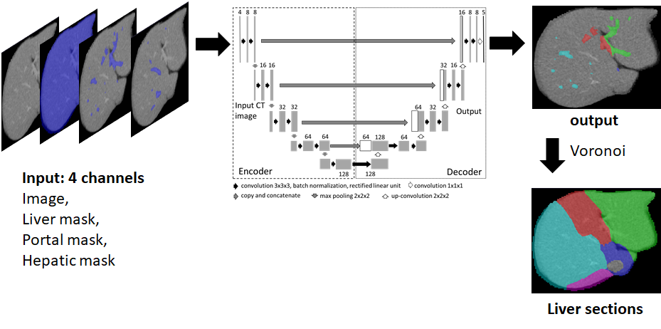

# Liver Segmentation


The network takes 4 inputs; CT image, Liver mask, Hepatic Vein Mask and Portal Vein mask.
It outputs portal vein branch labels which is then used to compute liver segments using 
Voronoi tesselation.

## Table of Contents
- [Prerequisites](#prerequisites)
- [Installation](#installation)
- [Usage](#usage)
- [Data](#data)
- [License](#license)

## Prerequisites

Before you begin, ensure you have met the following requirements:

* You have installed [Docker](https://www.docker.com/)
* You have a compatible operating system (e.g., Windows, macOS, or Linux)

## Installation

To set up the project using Docker, follow these steps:

1. Clone the repository:

```bash
git clone https://github.com/username/LiverSegmentation.git
cd LiverSegmentation
```

2. Build the Docker image:
```bash
docker build -t LiverSegmentation:latest .
```

## Usage
1. Run the docker container:
```bash
docker run --gpus all -v path/to/LiverSegmentation/:/home/LiverSegmentation -it LiverSegmentation:latest
```

2. Training the neural network

Four different models are prepared for labeling portal vein into 8 segments. First neural network labels portal vein into 5 section labels (S1, S23, S4, S58, S67).
Next three neural networks are used to further subdivide each section into two sub sections. 

```bash
python main.py --exp_name="5section" --train --num_classes=5 --gpu_num=0 --data_dir="./data/"
```

```bash
python main.py --exp_name="S23" --train --num_classes=2 --gpu_num=0 --data_dir="./data/"
```

```bash
python main.py --exp_name="S58" --train --num_classes=2 --gpu_num=0 --data_dir="./data/"
```

```bash
python main.py --exp_name="S67" --train --num_classes=2 --gpu_num=0 --data_dir="./data/"
```
3. Testing the neural network

```bash
python main.py --exp_name="5section" --test --num_classes=5 --gpu_num=0 --data_dir="./data/"
```

```bash
python main.py --exp_name="S23" --test --num_classes=2 --load_model_dir="./train/model_files/S23/" --gpu_num=0 --data_dir="./data/"
```

```bash
python main.py --exp_name="S58" --test --num_classes=2 --load_model_dir="./train/model_files/S58/" --gpu_num=0 --data_dir="./data/"
```

```bash
python main.py --exp_name="S67" --test --num_classes=2 --load_model_dir="./train/model_files/S67/" --gpu_num=0 --data_dir="./data/"
```

## Data
```
data/
│
├── train/
│ ├── image_id.hdr
│ ├── image_id.raw
│ ├── image_id.msk
│ └── image_id.label
│
└── test/
├── image_id.hdr
├── image_id.raw
├── image_id.msk
└── image_id.label
```
Within each subdirectory (`train/` and `test/`), the user must place four files for each training data point:

- `image_id.hdr`: Contains information about the image size and voxel spacing.
- `image_id.raw`: A binary image containing the abdominal CT image.
- `image_id.msk`: Contains liver mask, IVC mask, portal mask, and hepatic mask stored in bits "0", "1", "2", and "3", respectively.
- `image_id.label`: Contains liver segment labels. By default, the code considers following labels for each of the liver segments, S1:1, S2:2, S3:3,S4:4,S5:5, S6:6, S7:7, S8:8

Make sure to replace `image_id` with the corresponding identifier for each image in both the `train` and `test` subdirectories.

## License
Code in this repository is bound by License issued from Fujifilm Corporation. Note that, the code must be used non-commercially. Please, see the details in LICENSE.txt file